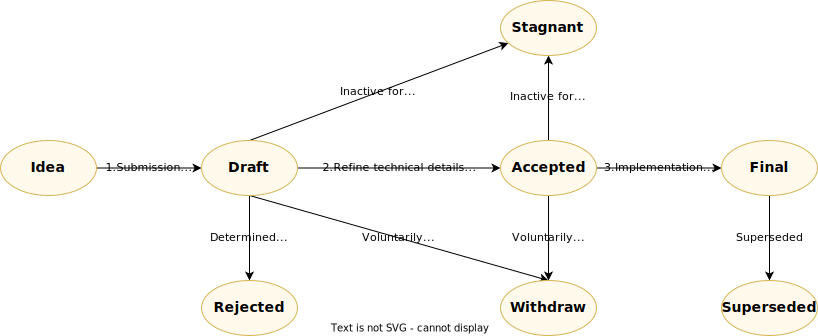

# Vechain Improvement Proposals

## Overview

A Vechain Improvement Proposal (VIP), is a design document that serves the purpose of providing information or describing a new feature within the vechain ecosystem. It outlines new standards for various aspects such as the core protocol, client APIs, digital assets, smart contract development and anything that shapes certain decentralized applications (dApps) built on the VechainThor blockchain. A key requirement of a VIP is to offer a clear and concise technical specification of the proposed feature. 

Additionally, the author of a VIP carries the responsibility of fostering consensus within the community and documenting any dissenting opinions that may arise during the proposal's evaluation process. This ensures transparency and inclusivity in the decision-making process.

We provide [the status page](./the-status-page.md) listing and tracking VIPs.

## Category

Here we define the following VIP categories:

+ **Core**: VIPs that focus on describing improvements on the VechainThor protocol (e.g., the consensus algorithm, transaction model, account model, runtime, etc.)  which may result in a consensus fork. Typically, they require broad agreement and coordination among the vechain community.

+ **Interface**: VIPs that concentrate on improving client API specifications and standards. They aim to improve interoperability and consistency in client implementations.

+ **Application**: VIPs that establish standards and conventions at the application level. It may include but not limited to standards related to the digital asset type, name registry, smart contract library, SDK for developing dApps, and etc. They provide guidelines for developing and deploying applications within the vechain ecosystem.

+ **Information**: These VIPs describe design issues or provide general information to the community. Although they do not propose new features, they serve to share valuable insights and knowledge within the Vechain ecosystem.

## Process

The following figure illustrates the review process for VIPs:

### Status

**Idea**: At this stage, applicants will need to prepare a document that describes their ideas and create a pull request(PR) on the repo. Meanwhile, they will also need to post their ideas on the [Vechain builders forum](https://vechain.discourse.group) to further engage with the dev community as well as reviewers for discussion. It is to ensure its originality and significance to the vechain ecosystem, and avoid wasting time on a potentially rejected proposal.

**Draft**: When an idea passed the review and received more than 3 approvals from the [reviewers](./#vip-reviewers) on GitHub, the proposal will be merge and given a VIP number as a `Draft`.

**Accepted**: There has been a consensus reached among all the participating reviewers that the VIP in `Accepted` has no technical issues and is ready to be implemented.

**Final**: A VIP enters the stage where it has been implemented within the vechain ecosystem. A VIP in this stage is considered complete and closed.

**Stagnant**: Any VIP in `Draft` or `Accepted` inactive for a period more than 6 months will become `Stagnant`. A `Stagnant` vip could be resurrected and move back to `Draft` if the author resumes work on it.

**Rejected**: A VIP will be marked `Rejected` if reviewers cannot reach a consensus on its technical contents. 

**Withdrawn**: A VIP will be marked `Withdrawn` if the author has formally withdrawn it. This state has finality and can no longer be resurrected using this VIP number. If anyone would like to work on this idea, it is considered a new proposal.

**Superseded**: A VIP will be marked `Superseded` if it has been replaced by a newer VIP.

### 1.Submitting a VIP

To submit a VIP, the author should follow these below steps:

1. Write the VIP using the [VIP template](./vip-template.md).
2. Submit a PR with the VIP to the [vechain/VIPs](https://github.com/vechain/vips) repository.
3. Create a new topic on the [Vechain Builders forum](https://vechain.discourse.group) and share the PR link along with the VIP description to initiate community discussion and gather feedback.
4. Update the VIP based on the community's feedback and suggestions.
5. Request a review from the operation team([@necosherry](https://github.com/necosherry)) under the PR once the VIP is ready.
6. The operation team will review the format and request the reviewers to review the content and technical details.
7. The proposal will be reviewed by VIP reviewers who will provide feedback and propose changes to improve the proposal.
8. To have the VIP merged, the author needs to receive at least **3 approvals** from the reviewers on the PR. All the reviewers who approved the VIP will form a working group and have a private channel for discussion on Discord.
9. The operation team will assign a number to the proposal and merge the PR, moving the proposal to the `Draft` state.

### 2.Refine technical details

For a VIP in `Draft` status:

1. The author of the VIP needs to work on refining the technical details of the proposal until it reaches a state where it can be practically implemented.
2. The author creates a PR to update the VIP in the [vechain/VIPs](https://github.com/vechain/vips) repository.
3. The reviewers within the working group will then thoroughly review the technical aspects of the VIP to ensure it could be implemented with the vechain protocol.
4. The author should request the reviewers in the working group to approve the PR if they are satisfied with the VIP's technical details.
5. For the VIP to move to the `Accepted` state, it requires at least **1 approval** from the reviewers in the working group. All reviewers must agree and have no issues or objections to the proposed VIP. 

### 3.VIP Implementation
VIPs in `Accepted` state will be implemented in a future release of the vechain protocol. 

#### For VIPs in the **Core** category or requiring changes to the client:
1. The core dev team will carry out the actual testing and implementation.
2. The core dev team may seek assistance from the author during implementation.
3. Once successfully implemented, the VIP will be changed to the `Final` status.
 

#### For VIPs in other categories:
1. The author of the VIP will be responsible for carrying out testing and implementation.
2. The author can request assistance from the working group during this process.
3. After completing the implementation, the author should submit a PR to update the necessary details and status of the VIP.

The VIP will need at least **1 approval** on GitHub from the reviewers within the working group to progress to the `Final` status.

## VIP Reviewers
The current VIP reviewers consist of the following members:

From Core dev teams:
+ [Peter Zhou](https://github.com/zzGHzz)
+ [Bin Qian](https://github.com/qianbin)
+ [Tony Li](https://github.com/libotony)
+ [Tofu Chu](https://github.com/laalaguer)
+ [Mog Lu](https://github.com/mongelly)
+ [Asbert Ma](http://github.com/asbertMa/)
 
From Vechain CTO team:
+ [Neil Brett](https://github.com/nwbrettski)
+ [Vineet Singh](https://github.com/vineet-codes)
+ [Ben Moran](https://github.com/BenMVeChain)
+ [Daithi Hearn](https://github.com/daithihearn)

## Community

+ Forum  - [Vechain Builders Website](https://vechain.discourse.group)
+ [Discord](https://discord.gg/vechain) - Join the Vechain server,  open “Channels & Roles” and select “Development on vechain”.  “BUILDER COMMUNITY” will show on the side bar.

## Conclusion

VIPs (Vechain Improvement Proposals) serve as a platform for the community to propose and discuss enhancements to the vechain ecosystem. By adhering to the VIP guidelines, individuals have the opportunity to contribute to the development of the Vechain blockchain.

 
