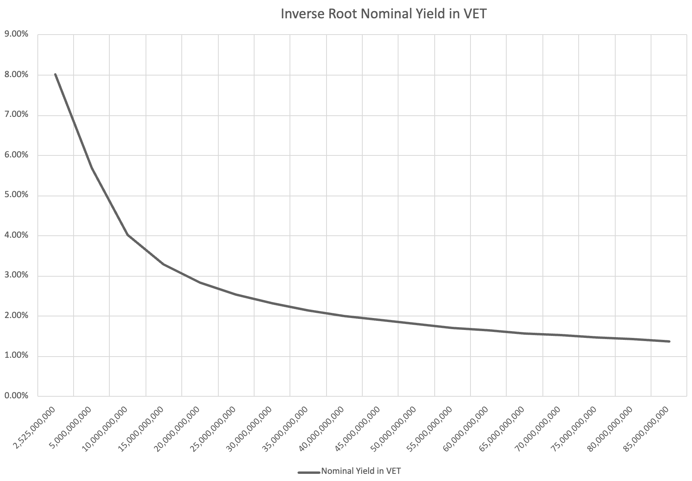

## Overview

This VIP deprecates the existing static VTHO generation rate and supersedes it with the new dynamic VTHO generation rate and block reward mechanism.

## Motivation

While the current static VTHO generation rate is efficient and scalable it does not align network incentives. As VeChain evolves towards greater decentralization and stakeholder participation, there is a growing need for improved VTHO tokenomics.

Upgrading the current static VTHO generation rate and distribution approach to be dynamic and based on staking VET will align network incentives and will lead to higher levels of crypto-economic security of the VeChainThor blockchain.

## Rationale

This VIP introduces a dynamic VTHO generation rate which will be distributed through block rewards, which are distributed exclusively to participants who stake VET and contribute to the security of the VeChainThor network. As a result of this change the network gains several advantages:

- **Aligned Incentives:** VTHO will only be generated by network participants that actively contribute to securing the network via VET staking.
- **Reduced VTHO Generation:** The VTHO generation rate will be a function of the staked VET and can result in the VTHO inflation rate being lower than the current VTHO inflation rate.
- **Greater Economic Security:** As more VET is locked in VeChainThor the greater economic security it offers to it's users.

## Specification

### Definitions

- **Stake:** The quantity of hard-locked VET that either a validator or delegator commits to securing the network.
- **Staker:** A general term referring to an entity, validator or delegator, that has staked VET.
- **Validator:** An entity that stakes VET and contributes hardware to the network. Validators are responsible for verifying transactions, adding new blocks, and maintaining network security and integrity.
- **Delegator:** An entity that entrusts their VET to a validator to participate in the network consensus. The delegator role is restricted to a single delegator contract.
- **Delegator Contract:** A trusted intermediary that provides a staking interface for VET holders to manage their delegation positions.
- **Active Delegation Position:** VET that has been supplied by the delegator contract targeting a validator and is earning rewards.
- **Inactive Delegation Position:** VET that has been supplied by the delegator contract targeting a validator and is no longer earning rewards.
- **Active Validator:** A validator that is participating in the leader group with their active status set to true.

### Parameters

- **Validator Reward Split:** 30%
- **Delegator Pool Reward Split:** 70% 

### VTHO Generation

Under the existing proof of authority (PoA) consensus mechanism, VTHO is generated at a fixed rate of 0.000432 VTHO per VET per day, distributed uniformly to all VET holders.

With the adoption of DPoS consensus, the fixed-rate VTHO generation will be discontinued. Instead, VTHO will be generated dynamically through block rewards, which are distributed exclusively to participants who stake VET and contribute to the security of the VeChainThor network. VTHO issuance will be a function of the quantity of staked VET with a curve of diminishing return on additional units of staked VET.

This modification aligns network incentives with active participation and strengthens the economic security of the chain by rewarding stakers rather than passive holders.

#### Curve

VTHO issuance will be an inverse root curve which recognises that there is a diminishing return to additional units of staked VET. As such as the quantity of staked VET increases the yield provided to validators will decrease.

#### Formula

$$VTHO Quantity = 1200 * 64 * \sqrt{Quantity Of Staked VET}$$

$$VTHO Yield = 1200 * 64 / \sqrt{Quantity Of Staked VET}$$

## Reference Implementation

### VTHO Generation

The existing mechanism for generating VTHO is based on the parameter EnergyGrowthRate in the params.go file. This parameter will be replaced with a formula representing an inverse root curve.

VTHO Generation will be discontinued by the start of the Hayabusa transition period, see [VIP-253](./VIP-253.md).

The VTHO issuance rate will be fixed for an epoch, 180 blocks, approximately 30 minutes. An active validator that proposes a valid block that is accepted onto the canonical chain will be rewarded with a block reward. The block reward will be determined by the inverse root curve function.

### Block Rewards

VTHO is minted and distributed at the time of block production after the protocol successfully transitioned to DPoS, see [VIP-253](./VIP-253.md), as part of the block reward process. Distribution is governed by the presence of active delegations:

- If the proposing validator has active delegation positions:
   - 30% of the VTHO is allocated to the validator.
   - 70% is allocated to the delegator contract, which distributes rewards to individual delegators based on their stake and reward weight.
- If no active delegation positions exist:
   - 100% of the VTHO is allocated to the validator. 

## Copyright
Copyright and related rights waived via CC0.
