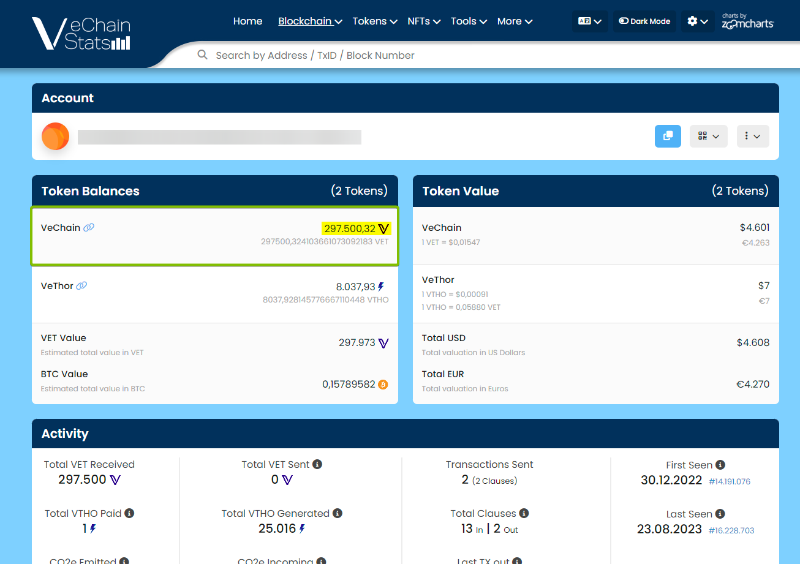

Did you sent your VET tokens to your Binance Smart Chain (BSC) address? This guide will help you retrieve them.

## Step 1: Verify that you sent your tokens with the VechainThor network
Double-check that you've sent your VET tokens by using the VechainThor network. You can easily check that by using https://vechainstats.com.
Copy the address you've sent your VET to. Paste the address in the search box on the VechainStats website and hit enter.

If your tokens are on the VechainThor network, then both the token and the transaction should be visible right now.

## Step 2: Download the official Sync2 wallet
Sync2 is, at the moment of writing, the only vechain wallet that supports a custom derivation path.
Download Sync2 on your preferred operating system.
- **Desktop**: https://sync.vecha.in/
- **Android**: https://play.google.com/store/apps/details?id=org.vechain.sync2&hl=en_US
- **Apple**: https://apps.apple.com/gb/app/vechain-sync2/id6446363029

> [!WARNING]
> Always double check that you download the wallet app from a trusted source!
After downloading the Sync2 wallet, continue to Step 3.

## Step 3: Import your wallet with your seed phrase
Open Sync2 on your mobile device or computer and choose the 'import' wallet option.
1. Enter the 12 words (seed phrase) that belong to your BSC address
2. Click on Advance
3. Select Custom
4. Complete the Path with: 714'/0'/0
5. Click on OK

And that's it! You imported your BSC wallet address on the VechainThor network.
You should see your tokens in your wallet.
If you somehow didn't succeed, please [Submit a Ticket](https://support.vechain.org/support/tickets/new).
