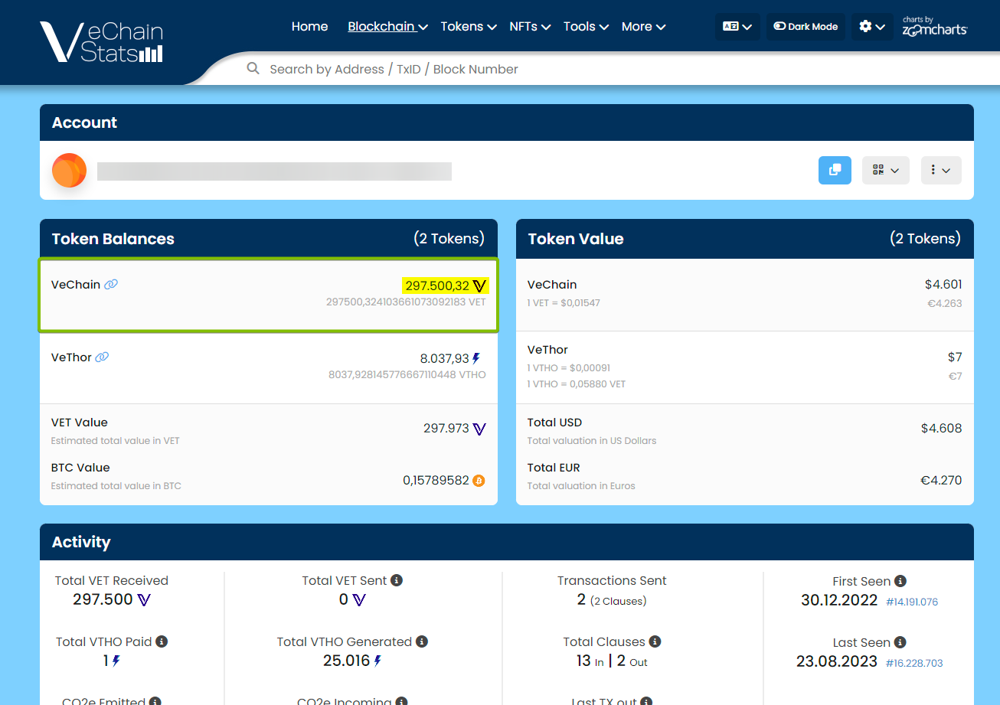

Did you sent your VET tokens to your Ethereum address? This guide will help you retrieve them.

## Step 1: Verify that you sent your tokens with the VechainThor network
Double-check that you've sent your VET tokens by using the VechainThor network. You can easily check that by using https://vechainstats.com.
Copy the address you've sent your VET to. Paste the address in the search box on the VechainStats website and hit enter.

If your tokens are on the VechainThor network, then both the tokens and the transaction should be visible right now.

## Step 2: Download the official Sync2 wallet

## Step 3: Import your wallet with your seed phrase
